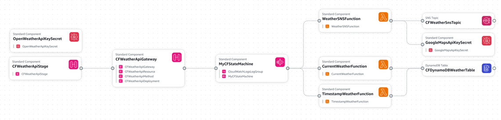

# DALHOUSIE UNIVERSITY

## Weatherscope: An Open-Source API Platform for Weather Data
### Project Report

**Author:** Zeel Ravalani  
**Email:** zeel.ravalani@dal.ca  
**Advisor:** Prof. Robert Hawkey  
**GitLab Link:** [Weatherscope Project Repository](https://git.cs.dal.ca/courses/2024-winter/csci4145-5409/ravalani/-/tree/main/TermProject)

---

## 1. Project Introduction
Weatherscope is a weather forecasting application that provides real-time and historical weather data for any location on Earth. It is an open-source public API platform that demonstrates a serverless weather data retrieval system built on AWS. The overarching goal is to provide fast, secure, and reliable access to real-time and historical weather information, catering to a wide range of potential users and applications.

## 2. Features
1. **Real-time Weather Data:** Fetches current weather conditions for a specified location, including temperature, humidity, wind speed, and more.
2. **Historical Weather Data:** Allows users to retrieve historical weather data for a particular date and time.
3. **Customizable Units:** Supports customizable units for temperature, wind speed, and other weather parameters.
4. **Location-based Forecasting:** Provides weather forecasts tailored to the user's exact location using longitude and latitude coordinates.
5. **Integrated Notifications:** Uses AWS Simple Notification Service (SNS) to send notifications for weather alerts, updates, and forecasts via SMS.
6. **Secure Data Handling:** Stores sensitive information such as API keys securely using AWS Secrets Manager.

## 3. Users
This system is designed for developers who want to integrate weather data into their applications. Weatherscope's API platform facilitates the development of weather-aware applications for various use cases, including agriculture, transportation, and outdoor event planning.

## 4. Menu Items Requirements
### Compute
**Selected Services:**
- **AWS Lambda:** Utilized for tasks including sending notifications, fetching current weather data, and retrieving historical weather data.
- **AWS Step Functions:** Orchestrates the execution based on user choices within Lambda functions.

**Alternatives Considered:**
- **AWS EC2:** Deemed unnecessary due to the lightweight nature of Lambda functions.
- **AWS Elastic Beanstalk:** Adds complexity compared to serverless options like Lambda.
- **Docker & AWS Elastic Beanstalk:** Lambda functions provided sufficient functionality without the need for containers.

**Justification:**
- Lambda functions provide a serverless environment, enabling efficient and cost-effective execution of code without server management. Step Functions enhance workflow orchestration.

### Storage
**Selected Service:**
- **AWS DynamoDB:** Utilized for in-memory caching of weather data, ensuring low latency and efficient storage and retrieval.

**Alternatives Considered:**
- **AWS S3:** DynamoDB was preferred due to its optimized performance for caching frequently accessed data.
- **AWS Aurora:** Not chosen due to potential credit consumption concerns and the simplicity of DynamoDB for caching purposes.

**Justification:**
- DynamoDB offers the required performance and scalability for caching weather data, ensuring quick access to frequently requested information.

### Network
**Selected Service:**
- **AWS API Gateway:** Acts as the public entry point to expose endpoints for fetching weather data.

**Alternatives Considered:**
- **AWS Virtual Private Cloud (VPC):** API Gateway was chosen for its simplicity and effectiveness in managing and securing API endpoints.

**Justification:**
- API Gateway simplifies creating, deploying, and managing APIs, providing robust security mechanisms and efficient request routing.

### General
**Selected Services:**
- **AWS Secrets Manager:** For securely storing sensitive API keys.
- **AWS SNS:** For sending SMS notifications.

**Alternatives Considered:**
- **AWS Kinesis:** SNS provided a simpler and more direct solution for sending notifications.

**Justification:**
- Secrets Manager ensures secure storage and controlled access to API keys. SNS facilitates secure notification delivery across various channels.

## 5. Deployment Model
**CloudFormation:** Utilizes Infrastructure as Code (IaC) principles to automate deployment and configuration management.

**Why CloudFormation:**
1. **Automated Deployment:** Reduces the risk of human error and ensures consistent deployments.
2. **Configuration Management:** Captures the entire infrastructure configuration, making it easy to manage and update over time.
3. **Scalability:** Enables scalable deployments, allowing effortless provisioning and management of resources.
4. **Version Control:** Templates can be version-controlled, providing a history of changes and facilitating collaboration.
5. **Repeatability:** Ensures repeatability in deployments, making it easy to spin up identical environments.
6. **Cost Optimization:** Supports parameterization and conditional logic, minimizing costs.
7. **Integration with AWS Services:** Seamlessly integrates with various AWS services.

## 6. Delivery Model
**Serverless:** Eliminates server management overhead and scales automatically with demand, reducing operational costs and complexity.

## 7. Final Architecture
### Cloud Mechanisms:
- **AWS Step Functions:** Orchestrates the workflow of the application.
- **AWS Lambda Functions:** Perform specific tasks like fetching weather data, storing it in DynamoDB, or sending an SMS notification.
- **Amazon DynamoDB:** Stores the weather data retrieved from the external API.
- **AWS Secrets Manager:** Securely stores API keys.
- **Amazon SNS:** Used to send SMS notifications.
- **Amazon API Gateway:** Allows users to trigger the Step Functions workflow through an HTTP POST request.

### Data Storage:
The weather data retrieved from the external API is stored in DynamoDB.

### Programming Languages:
- **JavaScript (Node.js):** The Lambda functions are written in JavaScript using Node.js runtime.

### Architecture Diagram

## 8. Security Considerations
- **Secrets:** API keys are stored securely in Secrets Manager.
- **IAM Roles:** Step Functions and Lambda functions have appropriate IAM roles with least privilege access.
- **CloudWatch Logs:** Logs are encrypted by default in CloudWatch.
- **API Gateway:** Only authorized users can access the API Gateway endpoint.

## 9. Vulnerability and Mitigation Strategies
1. **Potential Vulnerability:** Injected malicious code in Lambda functions could compromise the system.
   - **Mitigation:** Implement code validation and input sanitization in Lambda functions.

2. **Potential Vulnerability:** Unauthorized access to the API Gateway endpoint.
   - **Mitigation:** Implement API key authentication or other authorization mechanisms for the API Gateway endpoint.

## 10. On-Premise Cost Estimation and Considerations
Replicating the serverless architecture on a private cloud would require significant upfront investment compared to the pay-as-you-go model of AWS. 

**Estimated Costs:**
- **Servers:** ~$10,000 - $50,000+ per server.
- **Networking Equipment:** ~$5,000 - $20,000+.
- **Database Software:** ~$5,000+ per license.
- **Workflow Management Software:** Variable depending on internal IT resources needed.
- **API Gateway Software:** Variable depending on internal IT resources needed.
- **Total Estimated Cost:** Roughly $50,000 - $100,000+ for initial hardware and software purchases.

## 11. Most Important Cloud Mechanism for Cost Monitoring
**Step Functions:** The number of executions and duration of each step within the workflow directly translate to cost. Monitoring Step Functions executions helps identify workflow inefficiencies and unexpected usage spikes.

## 12. Future Evolution and Cloud Mechanisms
- **Real-time Data Processing:** Integrate with Amazon Kinesis for processing real-time weather data streams.
- **Advanced Analytics:** Add features for analyzing weather data trends or correlations using Amazon SageMaker.

## 13. Conclusion
This serverless weather data retrieval system demonstrates the advantages of AWS cloud services. It utilizes Step Functions for workflow orchestration, DynamoDB for flexible storage, and API Gateway for secure access. The serverless architecture ensures scalability and cost-effectiveness, making it a valuable tool for developers who need to integrate weather data into their applications.

---

## References
1. “AWS Academy” Instructure.com, [Online]. Available: [AWS Academy](https://aws.amazon.com/training/awsacademy/) [Accessed: 9 April 2024].
2. “AWS CloudFormation Documentation” Amazon.com, [Online]. Available: [AWS CloudFormation Documentation](https://docs.aws.amazon.com/cloudformation/) [Accessed: 9 April 2024].
